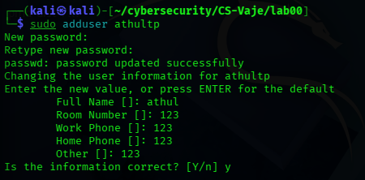
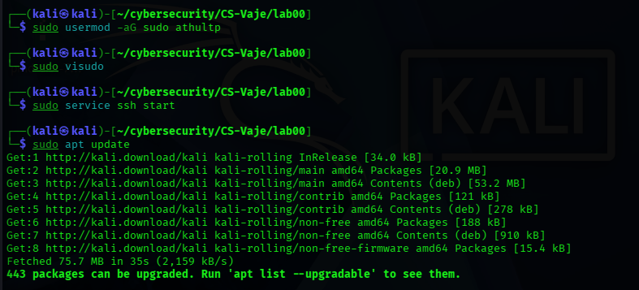
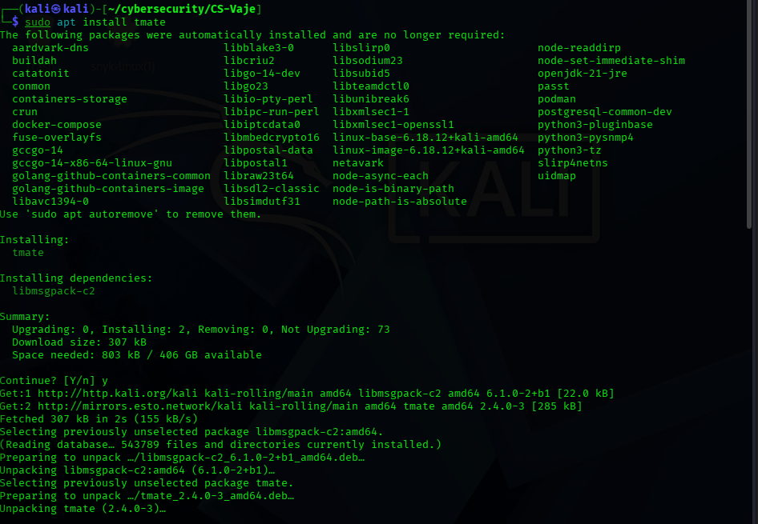
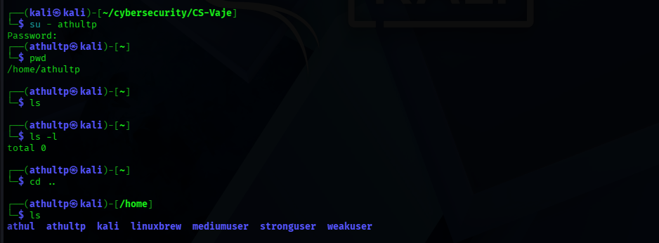
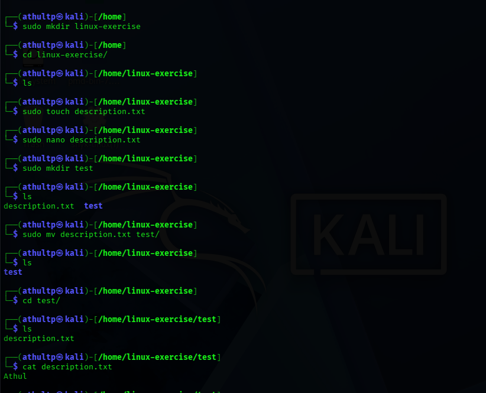

# Lab 00 - Introduction to Linux: Basics of Working in the Command Line

## Student Information
- Name: Athul Thuvattu Paramabath
- Enrollment Number: 35250310

## Objective

The objective of this lab was to learn the basics of working in a Linux command-line environment. The exercise included users setup, connecting to the system, file directory operations, permissions, system information commands, and SSH-related preparation.

### Steps Performed
1. Opened the Kali Linux terminal.
2. Switched from the default user to the lab user using 'su -athultp'.
3. Entered the password for the new user.
4. Confirmed the active home directory with 'pwd'.
5. Listed the current directory content with 'ls' and 'ls -l'.
6. Moved to the parent directory using 'cd ..'.
7. Displayed the available users inside '/home'.

## Result 

- The session was successfully connected under the user 'athultp'.
- The directory changed to '/hme/athultp'.
- Basic navigation commands were verified successfully.
!


## Environment Setup
In this lab, I used Kali-Linux environmanet in virtual-box.

### Steps Performed
1. Checked the current user account using 'whoami'.
2. Created a new user account with 'adduser'.
3. Added the user to the 'sudo' group using 'usermod -aG sudo'.
4. Edited sudo privileges using 'visudo'.
6. Updated the package list using 'apt update'.
7. Installed 'tmate' using 'apt install tmate'.

### Result
- The user 'athultp' was created successfully.
- Sudo privileges were configured.
- SSH service started.
- 'tmate' was installed.




## Basic Command-Line Tasks

### 1. Navigation the System
I checked my current directory and moved through the Linux filesystem using basic navigation commands.

#### Commands Used
```bash
pwd
ls
ls -l
cd ..
```

#### Result
- I confirmed my current working directory.
- I displayed directory contents.
- I moved to the parent directory successfully.



### 2. Working with Files and Directories
I created directories and files, edited a text file, and moved the file into another folder.

#### Command Used
```bash
mkdir linux-exercise
cd linux-exercise
touch description.txt
nano description.txt
mkdir test
mv description.txt test/
```

#### Result
- The 'linux-exrecise' directory was created.
- The 'description.txt' file was created successfully.
- A 'test' directory was created.
- The file was moved into the 'test' folder.



### 3. Moving and Copyng Files
I renamed the file and copied it to my home directory.

#### Command Used
```bash
mv description.txt my_profile.txt
cp my_profile.txt ~/
```
### 4. Permissions and Sizes
I checked file sizes and modified file permissions to make the file read-only.

#### Command Used
```bash
ls -lh
du -sh ./*
chmod 644 my_profile.txt
```
#### Result
- File sizes were displayed.
- Permissions were reviewed.
- 'my_profile.txt' was set to read-only for normal users.



### 5. System Information
I checked the username, system details, and available disk space.

#### Commands Used
```bash
whoami
uname -a
df -h
top
```

### Result
- My username was confirmed.
- System information was displayed.
- Disk usage information checked.
- Runnibg processes were viewed.




