# Lab 1:Introduction to Kali Linux

## Prepared by
Name: Athul Thuvattu Parambath
Enrollment Number: 35250310

## Purpose
This lab is focused on exploring the Kali Linux environment and Identifying its role in cybersecurity workflows. Kali Linux is a specialized Linux distribution used for penetration testing, security assessment, and forensics analysis.

## Basic command line practice

The screenshots show basic system verification commands such as whoami, hostnamectl, uname -a, df -h, and ip a 

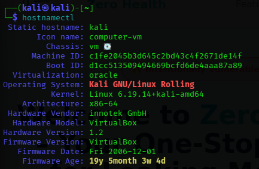

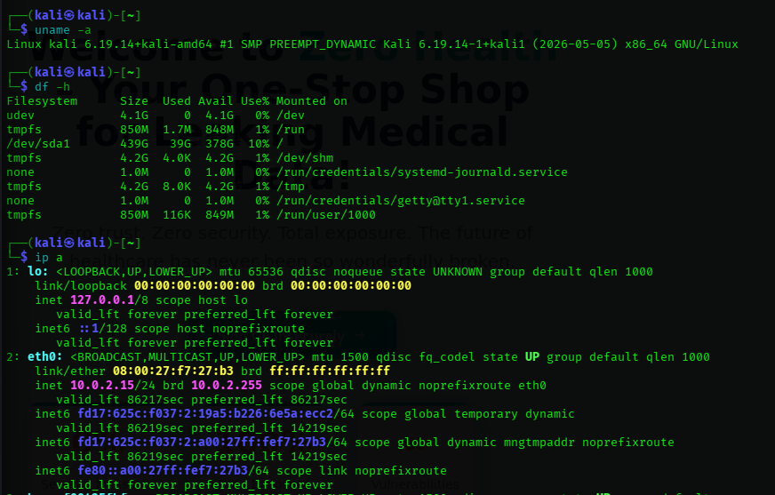

They also show the use of tools including wget, nmap, john, htop, traceroute, nload, strings, tcpdump, searchsploit, dnsenum, lbd, and nth

 
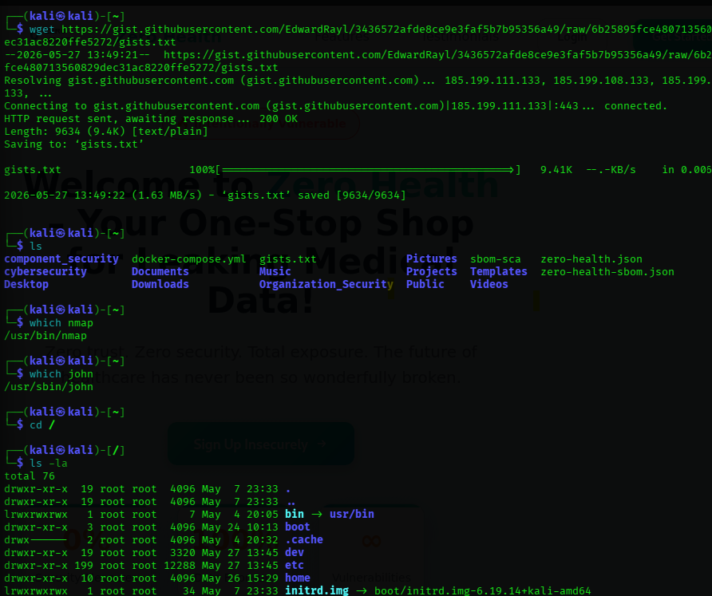

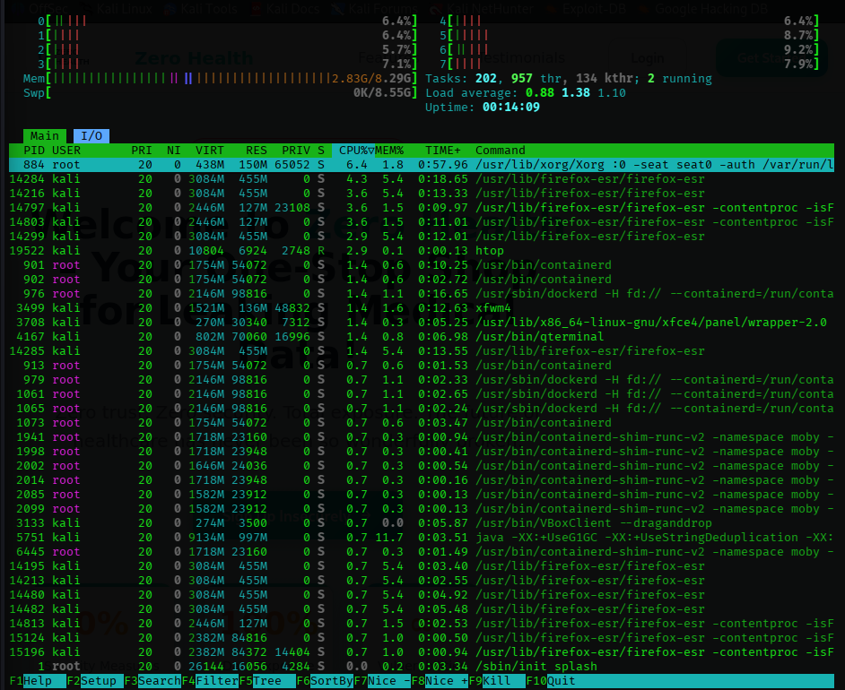

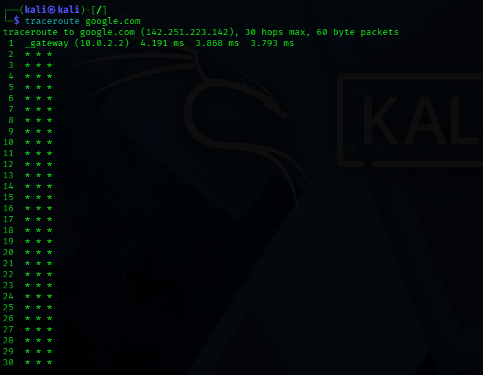

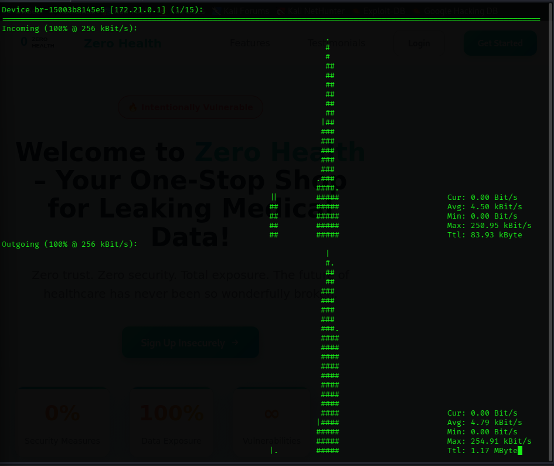

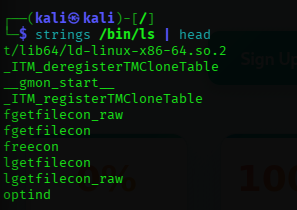

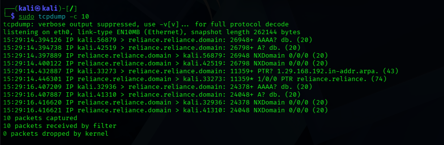

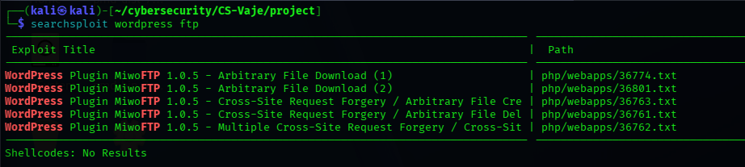

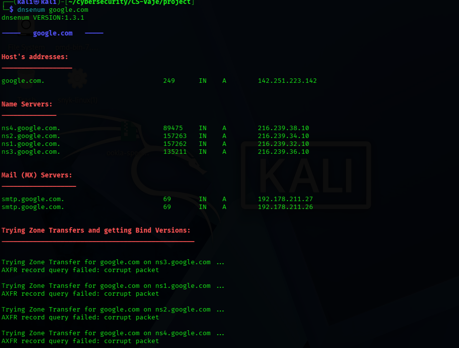

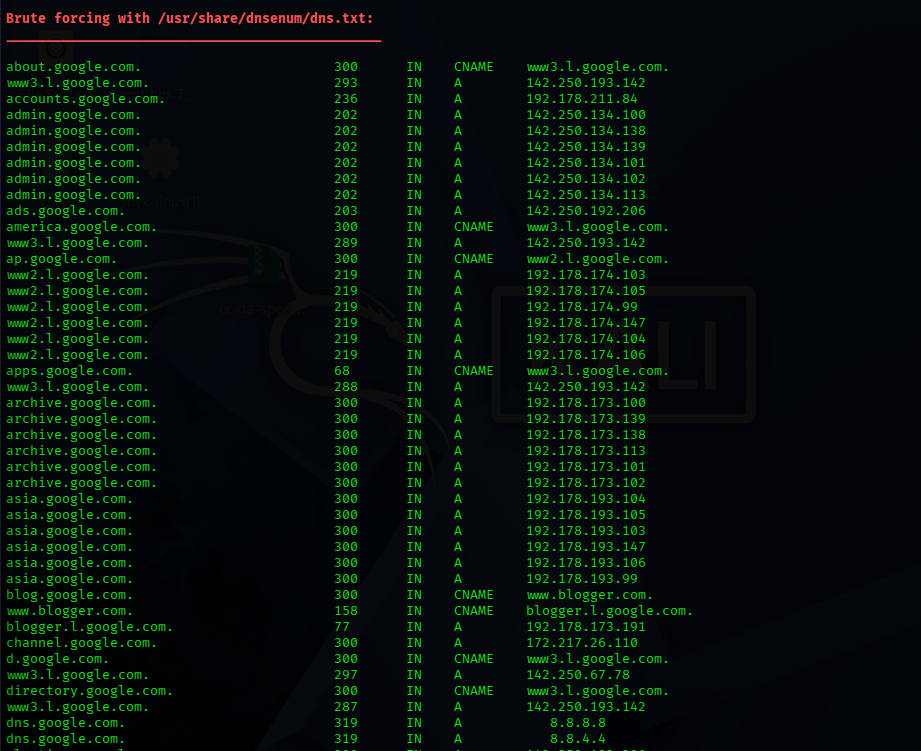

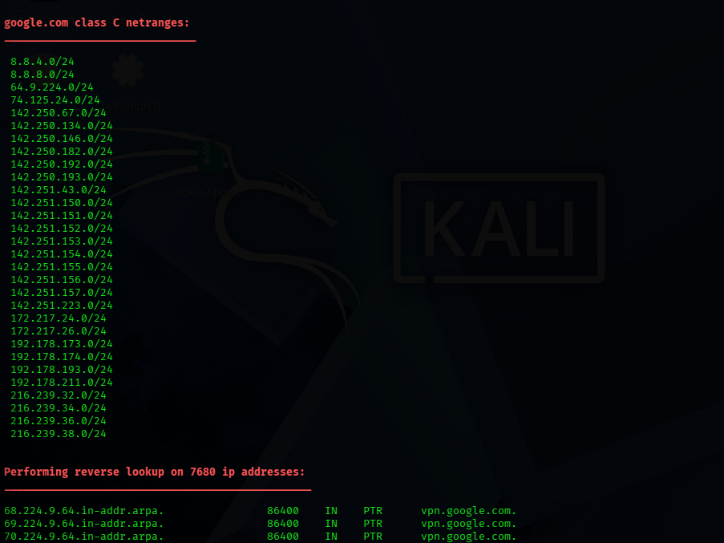

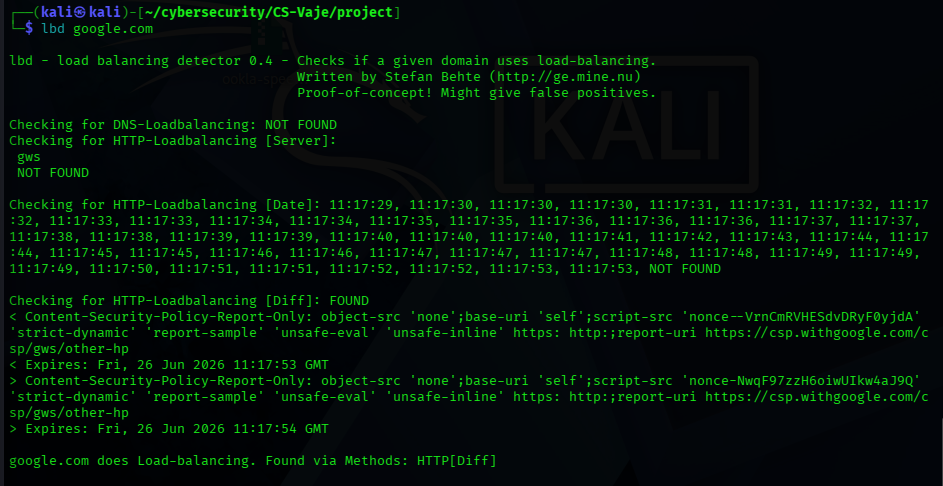

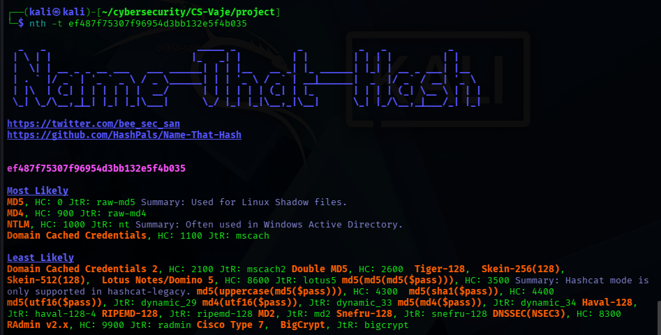

## Conclusion
This lab improved familiarity with the Kali Linux interface and its core tools. It highlighted how a security-focused operating system can support learning, testing, and analysis in cybersecurity.
