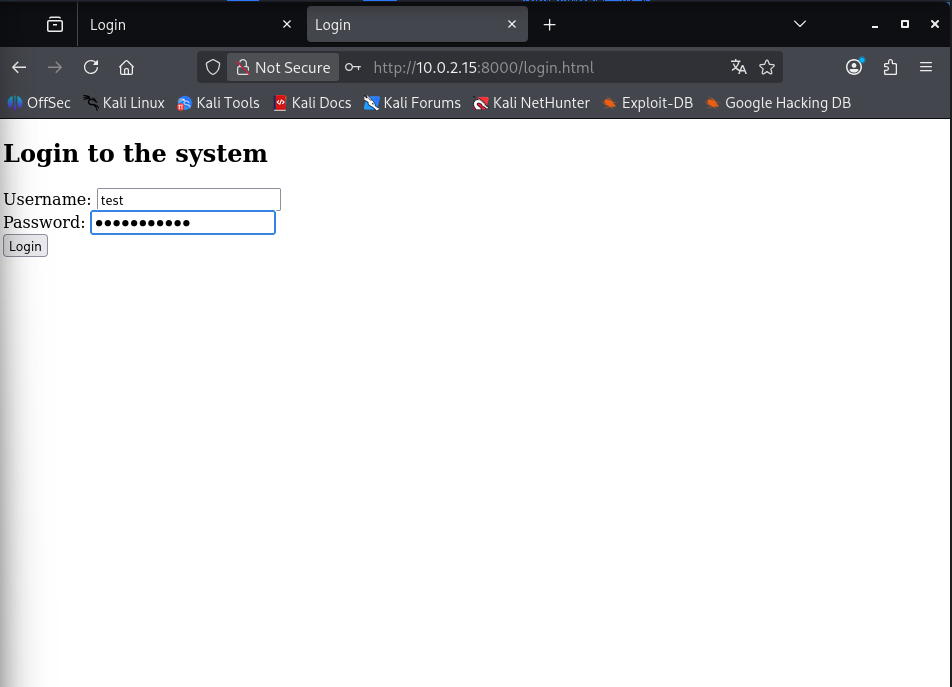
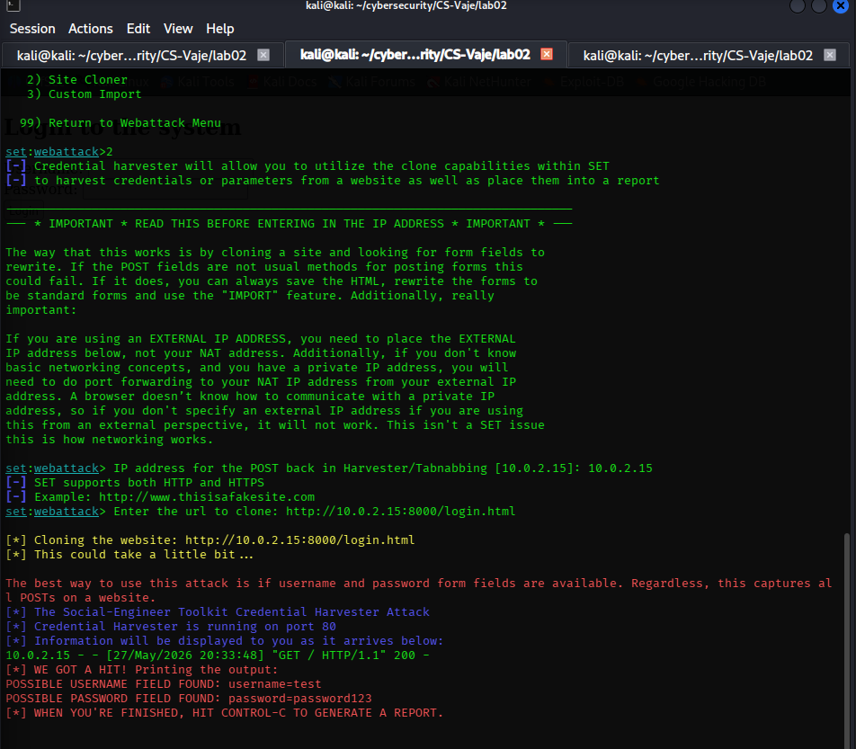
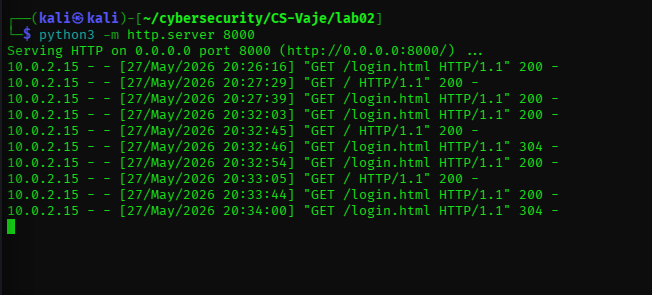
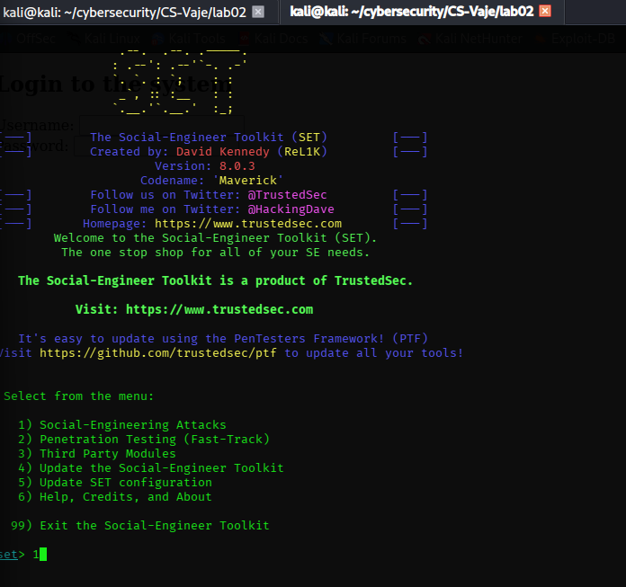
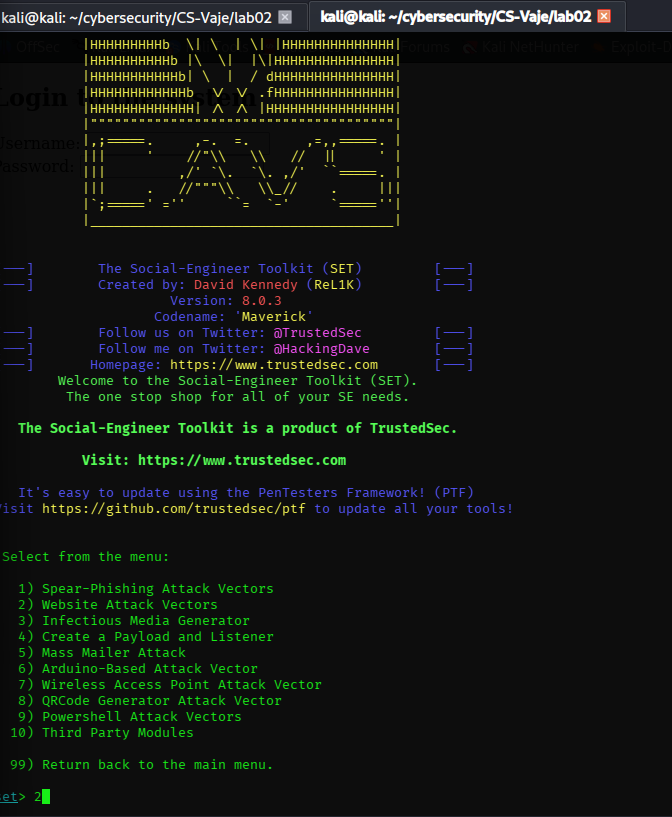
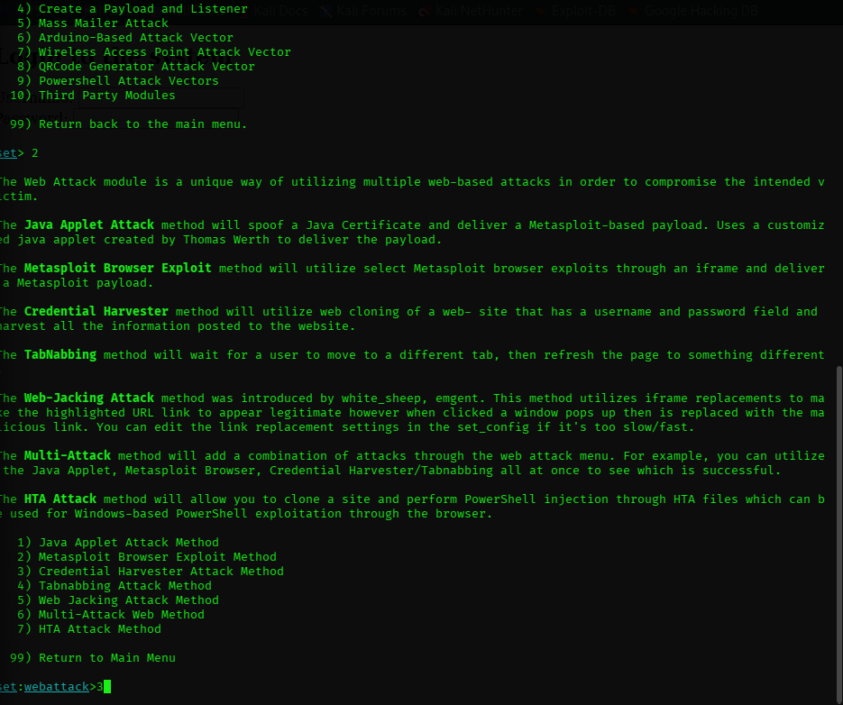
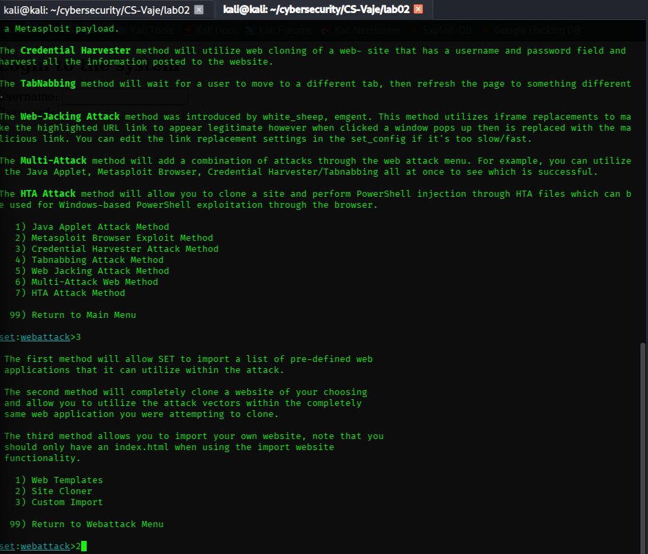
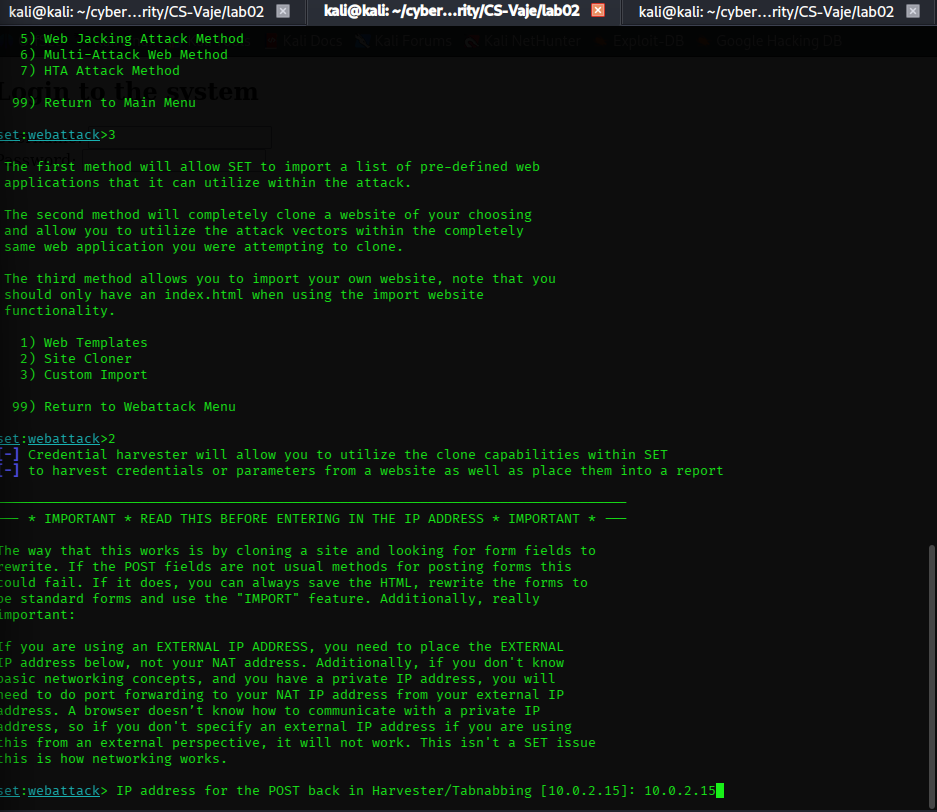
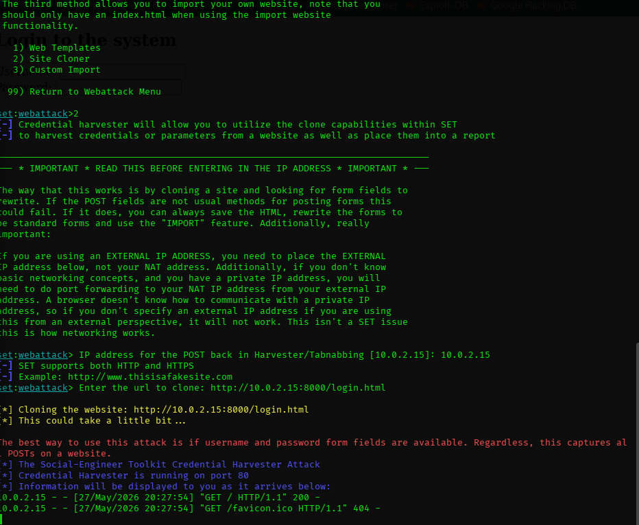
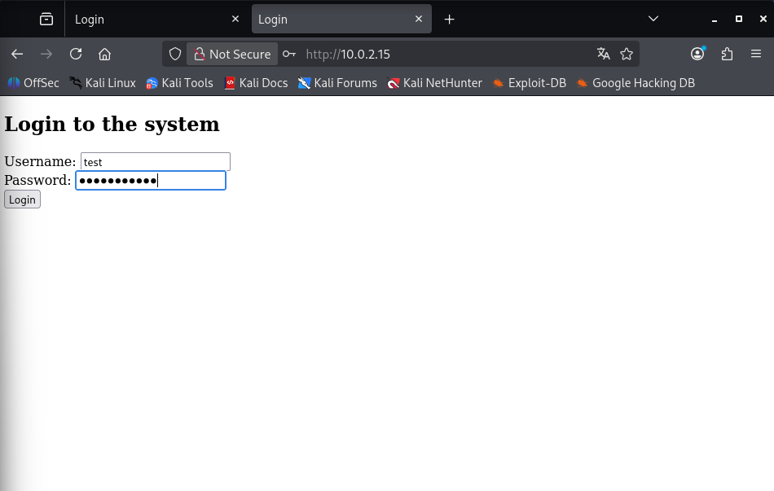

# Identifying and Preventing Phishing Attacks
## Lab Report - Social Engineering Toolkit (SET) Credential Harvester

**Student:** Athul Thuvattu Parambath
**Enrollment Number:** 35250310

---

## Analysis and Report

###1. Fake login page shown in browser

**The phishing login page served by SET. This is a cloned version of the custom login.html.**

###2. Screenshot of the Terminal with Captured Data

**SET terminal displaying the captured username and password after the form was submitted.**

This demonstrates how easily credentials can be stolen through a phishing page.

###3. How the Victim Would Recognize This is a Phishing Page ?

A victim could identify this as a phishing page by checking the following:

- **Wrong URL:** The page is accessed via an IP address (e.g. 10.0.2.15) instead of a legitimate domain name.

- **No valid certificate:** Even if HTTPS is shown, the certificate does not belongs to a trusted organization.

- **No Context:** The user arrived at the page unexpectedly (e.g. via email link).

## Reflection and Analysis

### 1. What are the characteristics if phishing page?

- **Suspicious URL:** Misspelled domain (e.g. g0ogle.com), IP address instead of domain, or unusual subdomain. 

- **Certificate problem:** Self-signed, expired, or issued to the wrong organization.

- **Poor quality:** Low-resolution logos, inconsistent fonts, awkard layout, spelling/grammar errors.

- **Urgency tactics:** Message like "Your account will be closed !" to pressure quick action.

- **Generic greetings:** "Dear User" instead of the actual account holder's name.

- **Missing trust elements:** No privacy policy, contact information, or footer links typical of real sites.

- **Unexpected request:** User is asked to enter credentials via email link without prior context.

---

### 2. How would you protect yourself from such an attack?

**Behavioral protection:**

1. **Check the URL carefully** - Verify the domain name is exactly correct before entering credentials.

2. **Type URLs manually** - For important sites, type the address instead of clicking links.

3. **Use bookmark** - Save trusted websites as bookmark to avoid phishing links.

4. **Be skeptical of emails** - Never click login links from unsolicited message.

5. **Check for spelling errors** - Phishing pages often contain typos or awkward phrasing.

**Technical protection**

1. **Enable multi-factor authentication (MFA)** - Even if password is stolen, attacker cannot access account.

2. **Use a password manager** - Auto-fill only works on matching domains, preventing credential submission to fakes.

3. **Keep browser updated** - Modern browser have built-in anti-phishing protection.

---

### 3. Why do modern sites make such attacks more difficult ?

Modern websites implement multiple defensive layers:

1. **Multi-factor authentication** - Stolen password alone is not enough for account access.

2. **Phishing-resistant MFA** - FIDO2/WebAuthn binds authentication to the specific domain - cannot be reused on fake pages.

3. **Browser protections** - Chrome, Firefox, edge maintain real-time phishing blacklist databases.

4. **Certificate transparency** - Invalid or suspicious SSL Certificates are more easily detected.

5. **Domain validation** - Organizations verify domain ownership before issuing certificates.

6. **Anti-phishing monitoring** - Services actively scan for and take down phishing copies of their pages.

7. **Better UI Indicator** - Browser shows clearer warnings for suspicious sites.

## Conclusion

This lab demonstrates how phishing attacks work through practical simulation using SET. The credential harvester successfully captured test credentials in plaintext, showing why users must never enter sensitive information on untrusted pages. The most important defense is user awareness, carefully checking URLs, verifying security indicators, and being skeptical of unexpected login requests. Technical controls like multi-factor authentication provide additional protection when user behavior fails.

## Reference 

[1] https://www.thesslstore.com/blog/5-ways-to-determine-if-a-website-is-fake-fraudulent-or-a-scam/

[2] https://www.torontomu.ca/ccs/services/ITSecurity/protecting-your-identity/phishing/website-phishing/#!accordion-1663879360270-website-phishing-and-mobile-devices

[3] https://www.nebraskalandbank.com/resources/learn/blog/are-you-on-the-right-website-a-guide-to-spotting-fakes/

[4] https://hoxhunt.com/blog/phishing-red-flags

[5] https://informationsecurity.wustl.edu/phishing-101/

## Screenshots 

