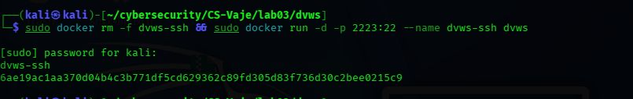
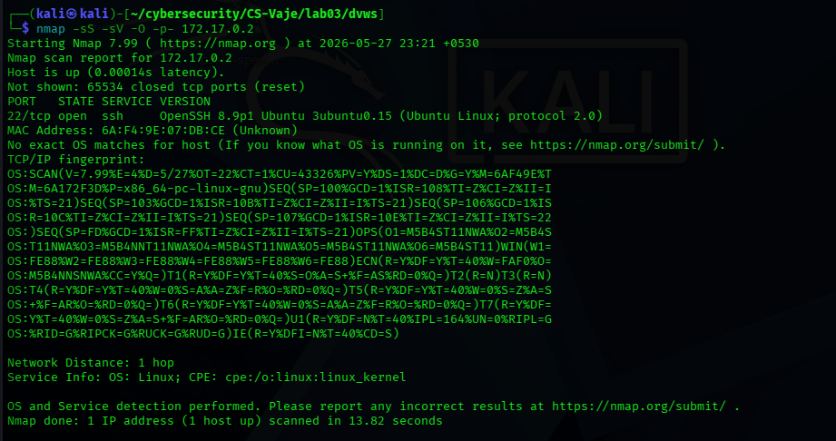
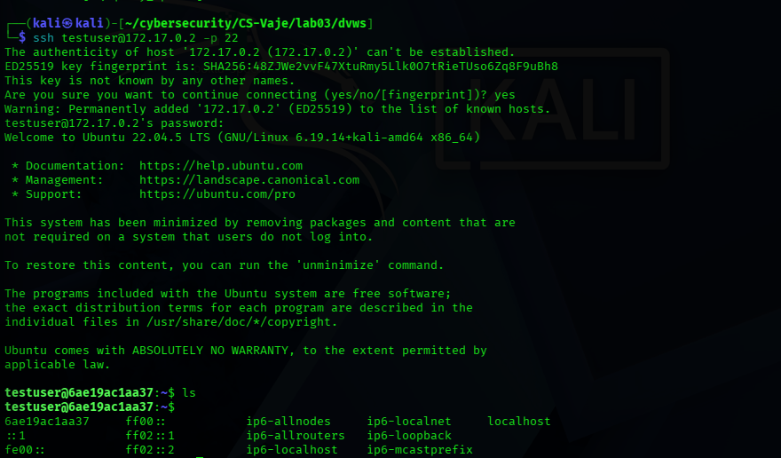
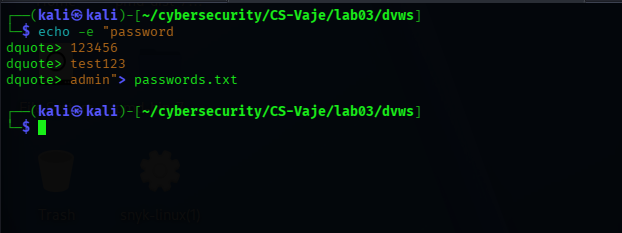
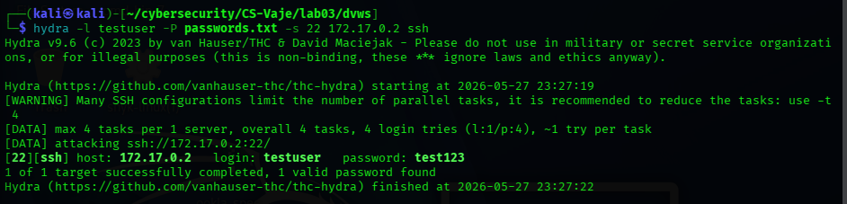

# Testing SSH Security with Nmap and Hydra - Exercise Report

**Student Name:** Athul Thuvattu Paramabath
**Enrollment Number:** 35250310

## Introduction

The goal is exercise is to learn how to:
- Use Nmap to detect open ports and services.
- Use Hydra to check SSH passwords via brute-force attack.
- Understand the dangers of weak passwords and open services.

## Experimpent

**Build Docker Image and start container**

**Get Target IP**

**Scan for open ports with Nmap**

**Findings:**
- Open ports: 22/tcp
- Service: SSH (OpenSSH 8.9p1 Ubuntu)
- Operating System: Ubuntu 3ubuntu0.15

**Verify SSH Connection**

 
**Created Password List**

**Brute-Force Attack with Hydra**

**Analysis and Report Summary**

- **Nmap Port Scan:**   Port 22/tcp
- **Service Detected:** SSH (OpenSSH 8.9p1 Ubuntu)
- **OS Detected:**  Ubuntu 3ubuntu0.15

**Why using weak passwords is dangerous and why closing unused ports?**

Weak passwords like test123, password, or 1234546 are extremely dangerous :

- Instantly crack able: Tools like Hydra can crack them in seconds.
- Common in wordlists: These passwords appear in every hacker's wordlists.
- No protection against automation: Attacker use automated brute-force tools that try thousands of passwords per minute.

Why closing unused ports is critical

- Reduces attack surface: every open ports is a potential entry point for attackers.
- Limits information leakage: Open ports reveal what services run on your system, helping attackers plan targeted attacks.
- Prevent exploitation of vulnerable services: Unused services may have unpatched vulnerabilities attackers can exploit.
- Minimizes unauthorized access points: Fewer open ports=fewer ways for attackers to penetrate the system. 

## Reflection and Analysis

### 1. How would you protect the SSH server from brute-force attacks?

- **fail2ban:** Automatically blocks IPs after failed login attempts.
- **Strong passwords:** Use 12+ character passwords with special chars, numbers, mixed.
- **SSH Key authentication:** Disable password auth, use public-private key pairs.
- **Change default port:** Move SSH from port 22 to non-standard port.
- **Rate limiting:** Limit login attempts using iptables or sshd_config MaxAuthTries.
- **2FA (Two-Factor Auth):** Add Google Authenticator or hardware tokens.

### 2. What additional measures (e.g. limit on the number of logins, use of public-private keys, firewall) would you recommend?

- **Firewall(UFW/iptables):** sudo ufw allow from <trusted IP> to any port 22.
- **Disable root login:** Set PermitRootLogin no in /etc/ssh/sshd_config.
- **Use SSH keys only:** Set PasswordAuthentication no in sshd_config.
- **Login attempt limits:** Set MaxAuthTries 3 and MaxSessions 2 in sshd_config.
- **Monitor logs:** Regularly check /var/log/auth.log for suspicious activity.
- **IP whitelisting:** Use AllowUsers or AllowGroups in sshd-config.
 
### 3. How does the result change if we use a very strong password?

- Passwords with12+ characters, mixed , numbers, and symbols create trillions of combinations.
- Not present in wordlists like rockyou.txt.
- Brute-force would require centuries to crack with current technology.

# Docker Port conflict Issue

- when trying to run the docker container with port 2222, there was a port conflict error

**Solution:** Changed the port mapping from 2222 to 2223. 

## Reference
- https://infosecwriteups.com/10-essential-ssh-server-security-tips-best-practices-b5643e3d509b
- https://nodeping.com/ssh_monitoring_best_practices.html
- https://sanderknape.com/2016/11/securing-your-server-ssh-configuration/
