# GPG Key Generation, Encryption, and Signing Report

**Name:** Athul Thuvattu Parambath
**Enrollment Number:** 35250310

## Exercise Objective
In this exercise, I practically used GPG(GNU Privacy Guard)to: 
- Generate a key pair
- Export and import a public key
- Encrypt a file
- Digitally sign
- Decrypt and verify a signature

GPG Installation Verification:

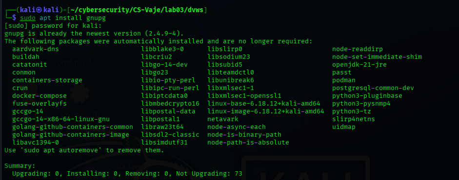

## 1. Generate Athul GPG Key Pair 

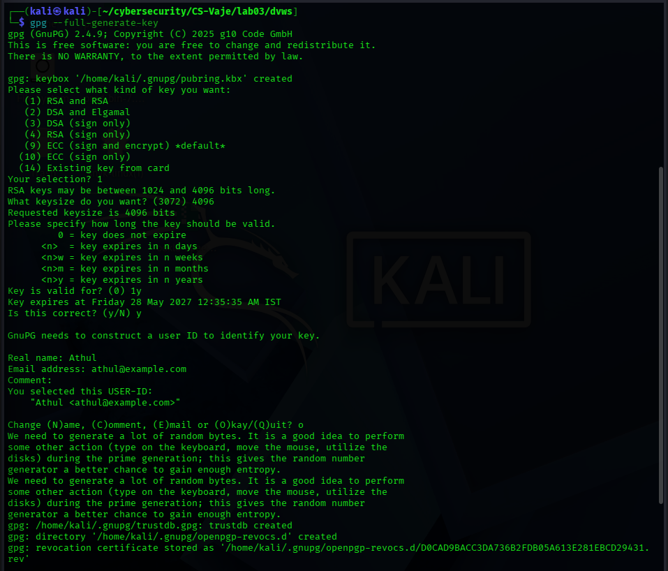

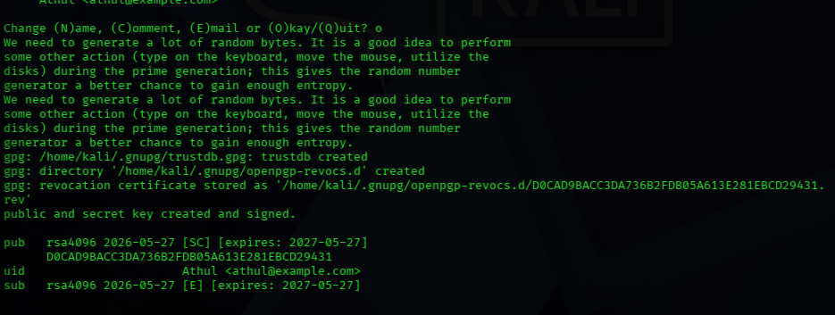

## 2. Generate Dona GPG Key Pair 

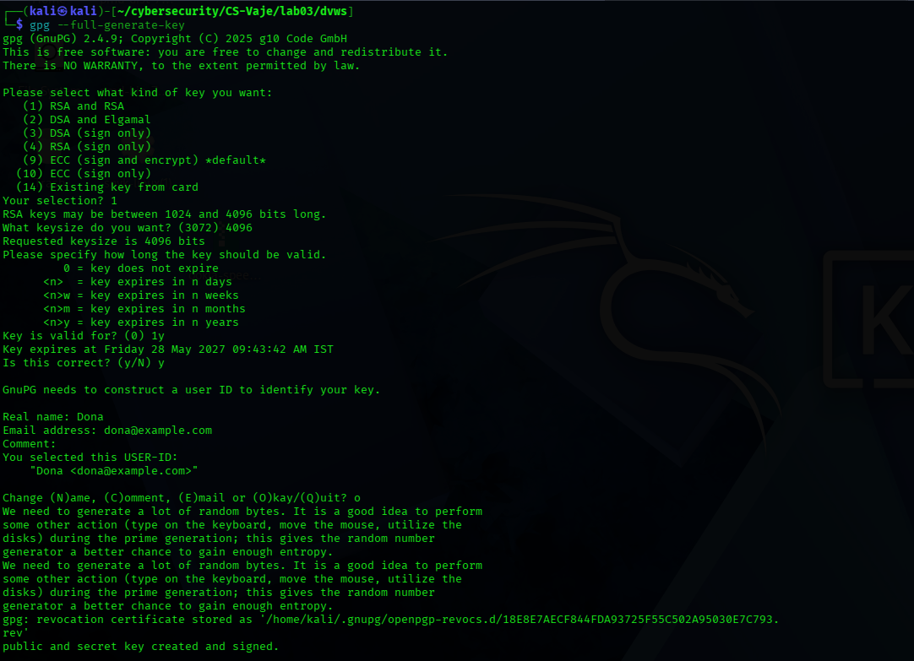

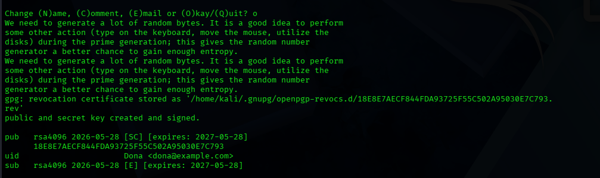

## 3. Export and Import Public Key

**Export Public Key(Athul)**

**Export Public Key(Dona)**

## 4. Import Foreign Public Key

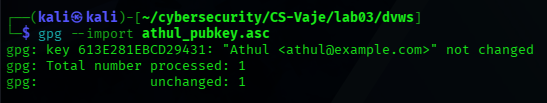

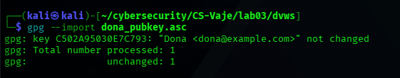

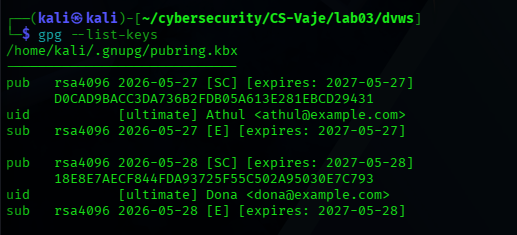

## 5. Preparing the Message

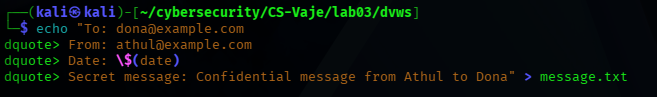

## 6. Encrypting and signing

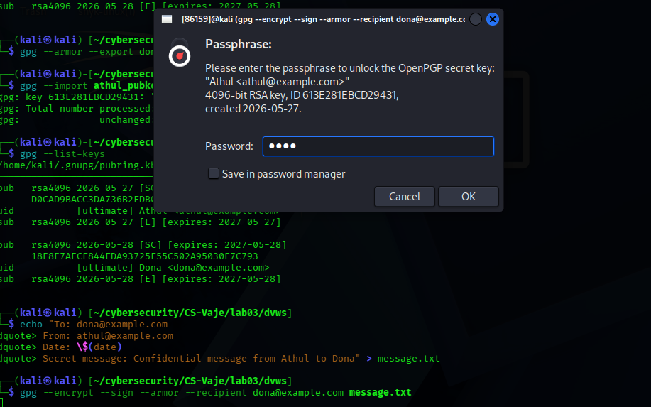

## 7. Decrypting and Verifying the Signature

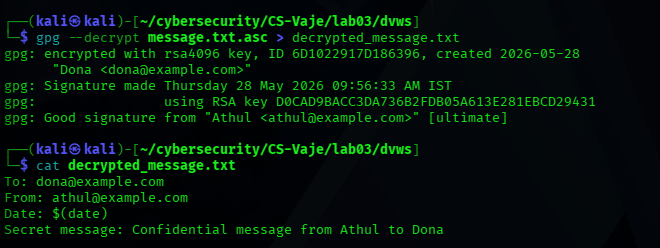

# Aditional Task

## 8. Revocation and Verifying Certificate

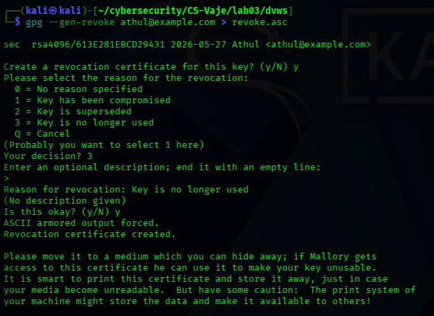

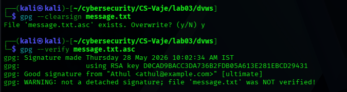

## Questions

## 1. Difference between Encryption and Signing.

Encryption and signing serve two different security purposes. Encryption provides confidentiality by ensuring that only the intended recipient can read the message. When Athul encrypts a message for Dona, he uses Dona's public key, and only Dona can decrypt it with her private key. The message content is hidden from anyone else.

Digital signing provides authentication and integrity. It proves who sent the message and that it was not tampered with during transmission. When Athul signs a message, he uses his own private key to create the signature. Anyone with Athul's public key can verify that the signature is authentic and that the message came from Athul and has not been modified.

## 2. Role of public and Private Key.

GPG uses asymmetric cryptography, which means each person has two keys: a public key and a private key. These keys work together but have different roles.

The public key is meant to be shared with everyone. You can send it to anyone or publish it on a key server. The public key has two uses. First, other people use your public key to encrypt message that they want to send to you. Only you can decrypt those messages because only you have the matching private key. second, other people use yiur public key to verify signatures that you created. this allow them to confirm that a message really came from you.

The private key must be kept secret and secure. Only you should have access to it, and it should be protected with a strong passphrase. the private key also has two uses. First, you use your private key to decrypt messages that were encrypted with your public key. No one else can decrypt these messages because no one else has your private key. second, you use your private key to create digital signature. when you sign a message, you use your private key to generate the signature, which proves the message came from you.

In this exercise, Athul's public key was shared with Dona so she could verify my signatures. Athul's private key was used to sign messages. Dona's public key was shared with me so I could encrypt messages to her. Dona's private key was used to decrypt the message I sent.

## 3. What happens when an encrypted file is modified ?

When an encrypted file is modified after encryption, the decryption process will fail. GPG will not be able to decrypt the file properly, and you will h=get an error message like "gpg: decryption failed: Bad session key" or similar.

This happens because encrypted files contain integrity protection. When GPG encrypts a file, it calculates a cryptographic checksum or message authentication code (MAC) and includes it in the encrypted data. This checksum is tied to the exact contents of the file, If even a single byte of the encrypted file is changed , the checksum no longer match.

When you try to decrypt a modified file, GPG recalculates the checksum and compares it to the one stored in the file. Since they do not match, GPG knows the file has been tampered with and refuses to decrypt it. This is actually a critical security feature. It prevents man in the middle attacks where an attacker try to modify encrypted data in traffic.

If you somehow bypass the check and decrypt a modified file, the output will be corrupted garbage data that is unreadable and useless. this is why GPG protects you from decrypting tampered data in the first place.

In addition to encryption integrity, if the file was also signed, the signature  verification will fail with "Bad signature" because the signed content no longer matches the original signature. This double protection (encryption integrity plus signature verification) ensures both confidentiality and integrity of your data.

