# GPG Man in the Middle (MITM) Attack Exercise Report

## Prepared By
**Student Name:** Athul Thuvattu Parambath
**Enrollment Number:** 35250310

## Exercise Goal
Understand that a public key alone does not imply trust, MITM attacks can occur during key exchange, fingerprint verification is crucial, and the Web of Trust helps detect such attacks.

## 1. Key Generation

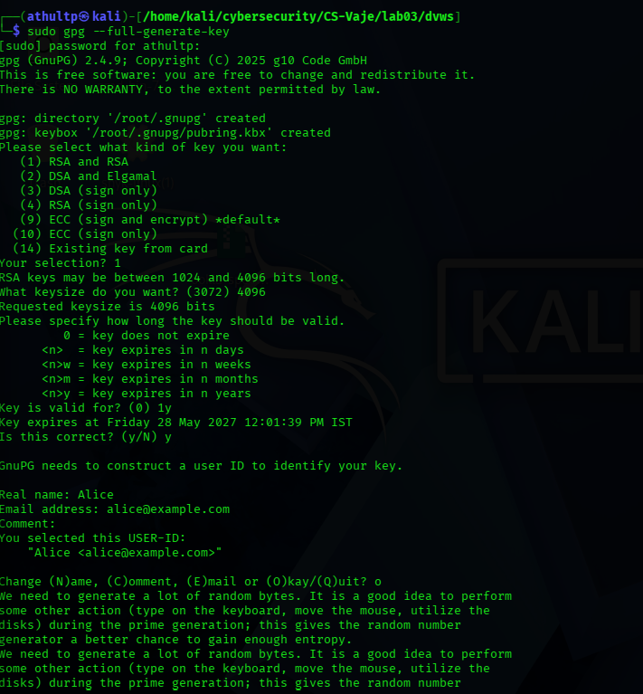

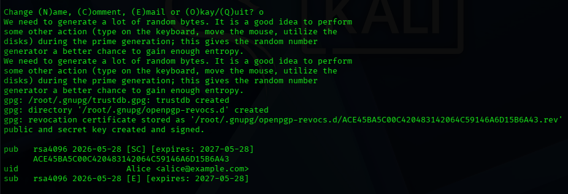

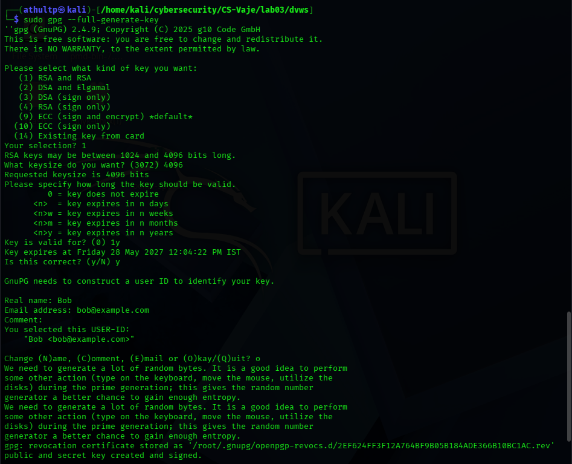

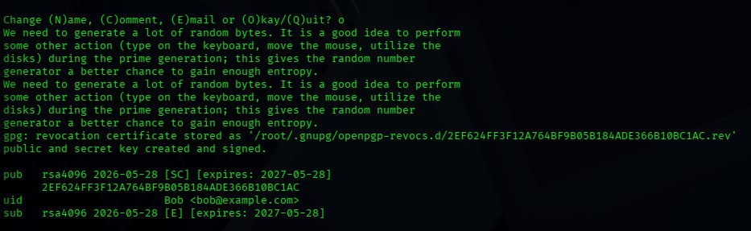

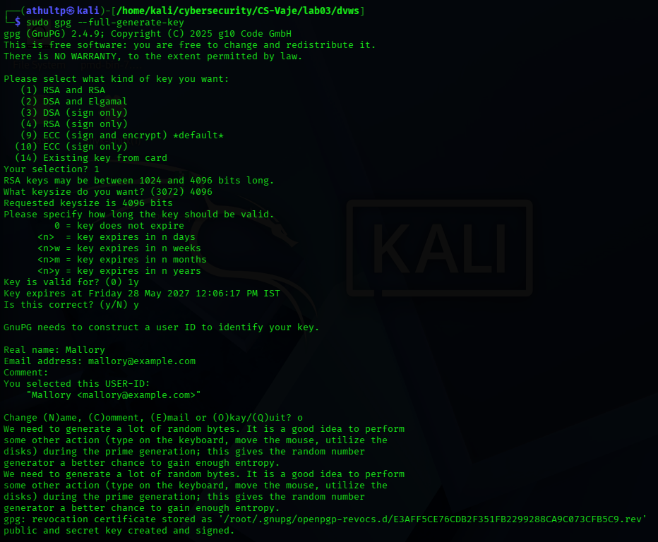

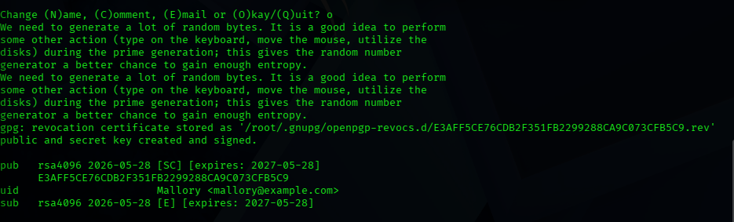

## 2. Verification

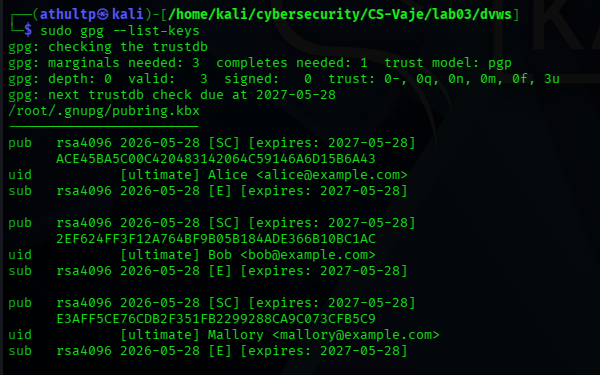

## 3. Fingerprint Printing

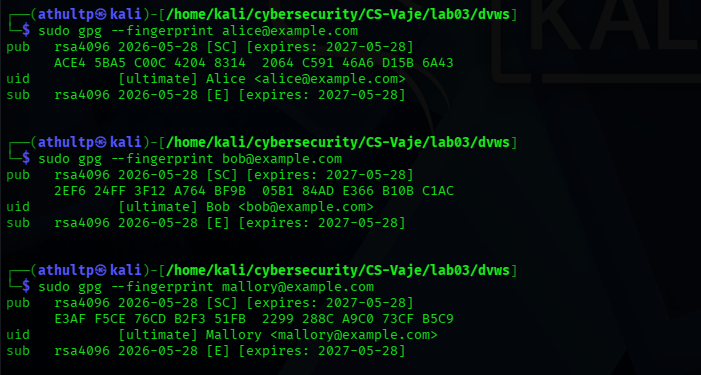

## 4. MITM Attack And Mallory Decrypts Message

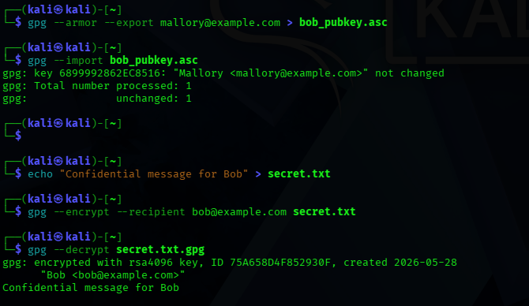

## 5. Web of Trust

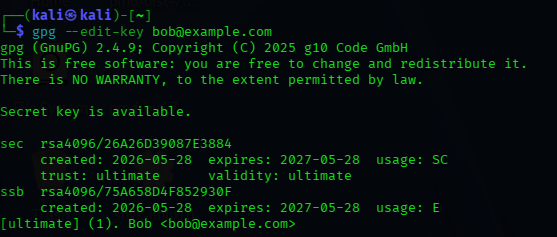

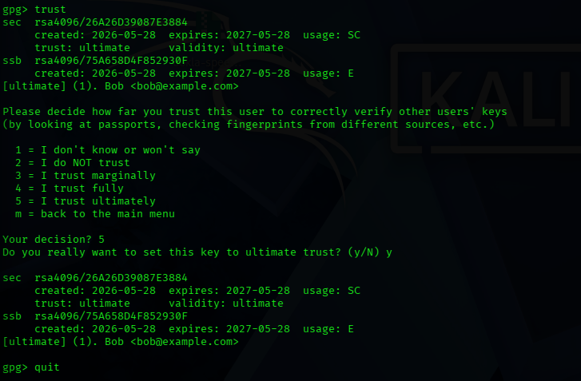

## 5. Additional Challenge: signing Bob's Key

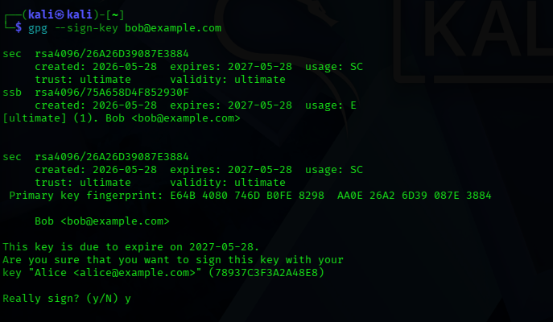

## Questions

### 1. Why doesn't GPG detect MITM attacks automatically?

GPG is a cryptographic tool, not a trust-management system. It assumes the user has verified the authenticity of public keys. GPG cannot distinguish between a genuine key and an attacker's key because:

- Public keys are openly distributable and can be forged or replaced.
- GPG has no built-in mechanism to verify the real-world identity behind a key.
- Trust must be established externally (e.g via fingerprint verification or Web of Trust)

Without explicit trust verification, GPG will happily encrypt to any key that matches the recipient ID, even if it's malicious.

### 2. What is a fingerprint and why is it important ?

A fingerprint is a 40-character hexadecimal hash uniquely identifying a GPG key. 

Why it's important:

- It is the only reliable way to verify that a key truly belongs to the claimed person.
- Even a single-bit change in the key produces a completely different fingerprint.
- Comparing fingerprints over a secure channel(in person, phone, video call) ensures no MITM substitution occurred.
- Without fingerprint verification, you cannot trust that you're using the correct public key.

### 3. Why is email not a secure channel for exchange keys?

Email is not secure for exchanging keys because:

- Emails is typically unencrypted or only partially encrypted (TLS in transit, not end to end)
- Attackers can intercept , modify, or spoof email messages (MITM)
- If Mallory intercepts the email containing Bob's public key, she can replace it with her own.
- Email itself relies on trust in the key signer; if the key wasn't verified, the entire chain compromised.

### 4. How does the Web of Trust reduce the risk of MITM attacks ?

The Web of Trust (WoT) is GPG's decentralized trust model where users sign each other's keys to vouch for their authenticity.

- If Alice trust Carol, and Carol has signed Bob's Key, Alice can trust Bob's key indirectly.
- Multiple signatures from trusted people make it harder for an attacker to inject a fake key unnoticed.
- Users can set trust levels(unknown, none, marginal, full, ultimate) tro control how much they rely on signatures.
- WoT creates a network of verified identities; an attacker would need to compromise multiple trusted users to succeed.

However, WoT still requires initial fingerprint verification for at least one direct trust anchor.

