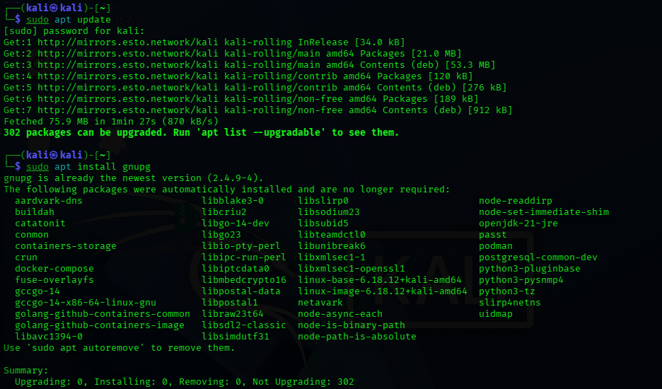
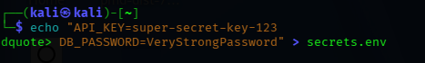
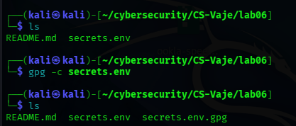
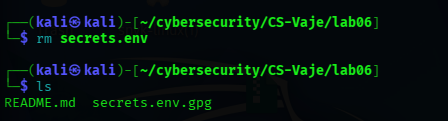
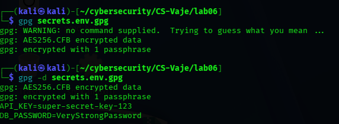
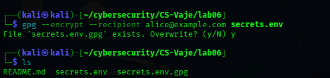
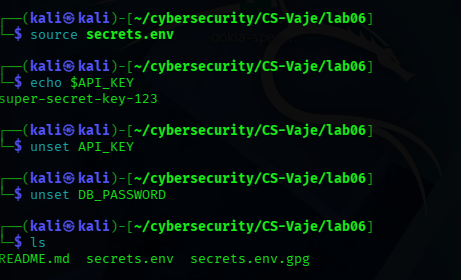
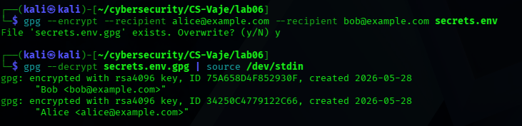

# Secret Management Using GPG - Exercise report

## Prepared By

**Students Name:** Athul Thuvattu Parambath
**Enrollment Number** 35250310

## Exercise Goal
Understand what secrets are, why they shouldn't be in source code, how to protect them with GPG, and the basics of secrets management without specialized tools.

## 1. Kali Linux update and Install Gnupg

## 2. Preparing Secrets(Unencrypted - Insecure)

- Created a secrets file in plaintext:

## 3. Symmetric Encryption of Secrets (Password-Based)

- Encrypted the file using a password

## 4. Remove secrets.env

## 5. Decrypting the Secrets

## 6. Asymmetric Encryption

## 7. Using secrets in an Application (Simulation)

- Unset Api key and Db Password

## 8. Multiple Users

## Reflection

### 1. Why don't secrets belong in source code ?

Secrets in code get exposed through sharing, leaks, or Git history. Bots find them in minutes, and one leaked key can open entire systems to attackers. Git never truly deletes them. secrets must be stored separately, encrypted, and accessed securely.

### 2. Symmetric vs Asymmetric encryption ?

Symmetric uses one password for both encrypting and decrypting. Simple, but you must share the password safely. Asymmetric uses a public key to encrypt and a private key to decrypt. No password sharing, more secure, and better for teams.

### 3. What if we lose the private key ?

You lose everything. GPG has no backdoor. encrypted secrets become permanently inaccessible. Always back up private keys securely offline or in a vault.

### 4. How to handle this in a large enterprise ?

Enterprises use dedicated tool like HashiCorp Vault, AWS Secrets Manager, or Azure Key Vault. These provide centralized access control, automatic secret rotation, audit logs, dynamic short-lived secrets, and integration with CI/CD. GPG is fine for personal or small-team use, but production need enterprise-grade secrets manager.

