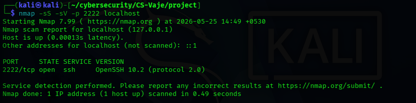
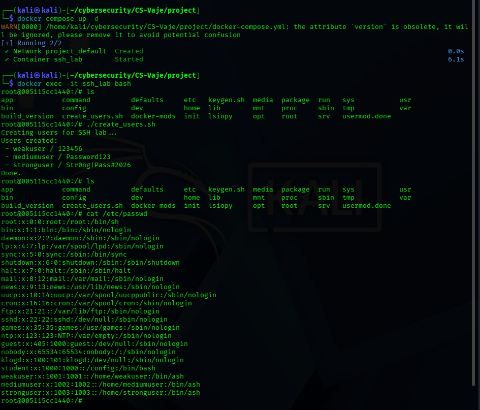
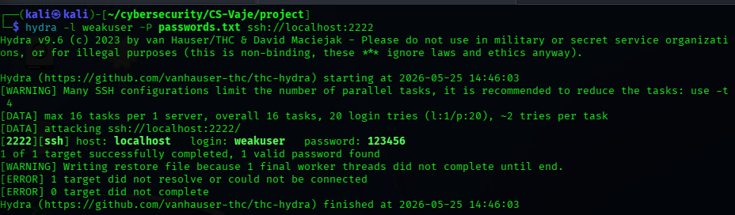
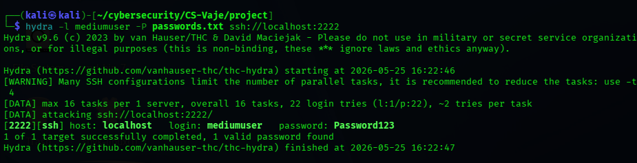
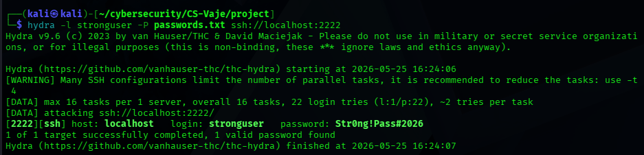

# Analysis of SSH Security Weaknesses in a Controlled Docker Environment

**Name:** Athul Thuvattu Parambath
**Course:** Master's in Cybersecurity
**Date:** 24 May 2026

## Abstract

This report evaluates the resilience of an SSH service against automated brute-force attacks in a controlled Docker-based laboratory environment. The study examines the influence of password strength and defensive mechanisms on authentication security by comparing three configurations: a weak password without protection, a strong password without protection, and a strong password protected by fail2ban. The results show that weak credentials are highly vulnerable to automated guessing, while stronger credentials substantially increase resistance to compromise. Fail2ban further reduces the effectiveness of repeated login attempts from a single source by enforcing temporary bans after a threshold of failed authentications. The findings support the use of key-based authentication, strong credential policies, and adaptive blocking as layered defenses for SSH services.

## 1. Introduction

Secure Shell (SSH) is widely used for remote system administration, but password-based authentication exposes it to brute-force attacks. When weak credentials are allowed, attackers can use automated tools to test many password guesses in a short time, which increases the risk of unauthorized access. This report investigates how password strength and rate-limiting controls affect the resilience of SSH authentication in a controlled laboratory setting.

The experiment was conducted in an isolated Docker environment to ensure that all testing remained local and authorized. Three configurations were selected for comparison: a weak password with no protection, a strong password with no protection, and a strong with fail2ban enabled. This design makes it possible to observe the effect of credential strength and defensive controls under similar testing conditions.

## 2. Methodology

The SSH server was launched inside Docker and exposed on 'localhost:2222' . This lab is to evaluate the effect of password strength and defensive controls on authentication resilience while ensuring that all testing remained local and authorized.

The laboratory environment was initialized using Docker Compose. The SSH container was started with the following command:

```bash
docker compose up -d
```

After the container was running, the user-creation script was executed inside the container to create the test accounts required for the experiment. The following commands were used:

```bash
docker exec -it ssh_lab bash
/create_users.sh
```

when i executed create_users.sh is already executable file.

This step created the three experimental accounts: 'weakuser', 'mediumuser', and 'stronguser'. The account creation was verified by listing the accounts inside the container.

Next, I used nmap to confirm that the SSH service active on port 2222 and to identify the service version.The scan used was:

```bash
nmap -sS -sV -p 2222 localhost
```

After confirming the service was running. I used Hydra to try logging in with a password list. For the weak account, the command was:

```bash
hydra -l weakuser -P passwords.txt ssh://localhost:2222
hydra -l mediumuser -P passwords.txt ssh://localhost:2222
hydra -l stronguser -P passwords.txt ssh://localhost:2222
```

The same method was used for the strong account to compare how password strength affects the result. I noted whether the login was successful, how long the attack took, and how many attempts were needed.

For the protected configuration, fail2ban was enabled to limit repeated failed SSH logins from a single source. A standard SSH jail configuration was used with a low retry threshold to simulate rate limiting behavior:

```bash
[sshd]
enabled = true
port 2222
maxretry = 3
bantime = 3600
findtime = 600
```
The status of fail2ban and its log message were reviewed to confirm whether the attacking source was blocked after repeated failures. This allowed the study to measure how rate limiting changes the behaviour of automated brute-force attempts.

## 3. Experiment

### Reconnaissance

The first step was a port and service scan of the local SSH server. The 'nmap' scan confirmed that TCP port '2222' was open and that the service was running OpenSSH. This verified that the target service was reachable before brute-force testing began.



### User creation

The Docker container was then started, and the user-creation script was executed inside the container. This step created the three accounts needed for the experiment and confirmed that the lab environment was correctly prepared before the attack phase.



### Brute-force testing

Hydra was used to attack each of the three accounts with the same password list. The screenshots show that the credentials for 'weakuser', 'mediumuser', and 'stronguser' were all recovered successfully from the wordlists. This demonstrates that the attack behaved as a dictionary attck rather than a pure guessing attack against random passwords.







## 7. Results

| Config | Password | Protection | Success | Time | Attempts |
|---|---|---|---|---|---|
| Weak password,   no protection | '123456' | None | Yes |    |     |
| Medium password, no protection | 'Password123' | None | Yes |    |    |
| Strong password, no protection | 'StrOng!Pass#2026' | None | Yes |    |    |

All three logins were successful because the tested passwords were present in the wordlist used by Hydra. This means the experiment demonstrates how dictionary attacks can succeed even when a password appears complex, if it is known or predictable to the attacker.

## 8. Discussion

The results show that password strength alone is not enough if the password appears in the attacker's dictionary. The weak, medium, and strong passwords were all recovered because the password list contained the correct values. This illustrates the practical danger of dictionary attacks, where success depends on whether the attacker already knows or can guess the target password.

The experiment also highlights the difference between a true brute-force attack and a dictionary attack. A brute-force attack tries all possible combinations, while a dictionary attack uses a preselected list of likely passwords. In this lab, Hydra's success indicates that the attack was effectively a dictionary-based credential test.

If rate limiting or fail2ban were enabled properly, repeated attempts from the same source would be slowed or blocked, which would make the attack less efficient. However, such controls would not stop every possible attack, especially if the attacker used multiple IP addresses, low-speed attempts, or distributed infrastructure.

From a usability perspective, stronger protections can sometimes inconvenience legitimate users if they are locked out after repeated mistake. For this reason, password policy, key-based authentication, monitoring, and rate limiting should be used together rather than relying on any single control.

## 9. Recommendations

The following improvements are recommended:

1. Use SSH key-based authentication instead of passwords whenever possible.
2. Enforce unique, high-entropy passwords that are not based on common patterns.
3. Add rate limiting or fail2ban-style protection to slow repeated login attempts.
4. Restrict SSH access through firewall rules or VPN access where possible.
5. Monitor SSH logs regularly for repeated login failures and suspicious behavior.

## 10. Conclusion

This experiment demonstrated that SSH accounts are vulnerable to dictionary-based attacks when the correct password is present in the attacker's wordlist. All three test accounts were successfully recovered, which shows that even a complex-looking password can be compromised if it is reused, predictable, or know in advance. The study therefore supports stronger authentication methods, better password hygiene, and additional protections such as rate limiting and monitoring.


